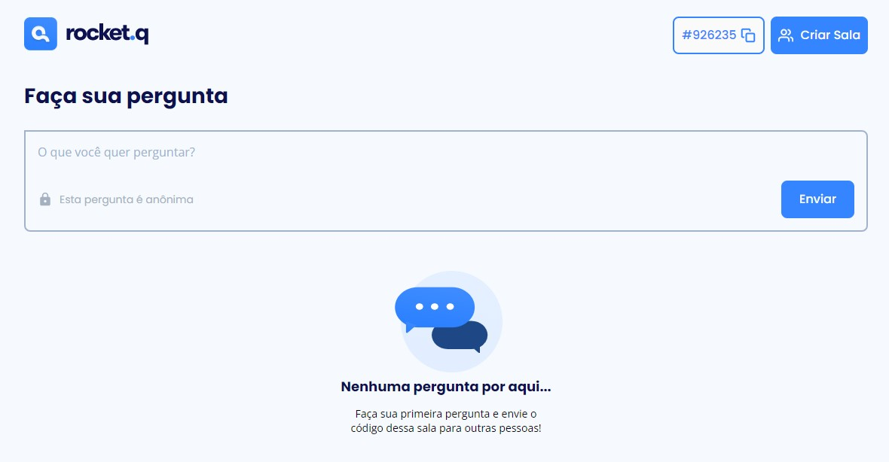
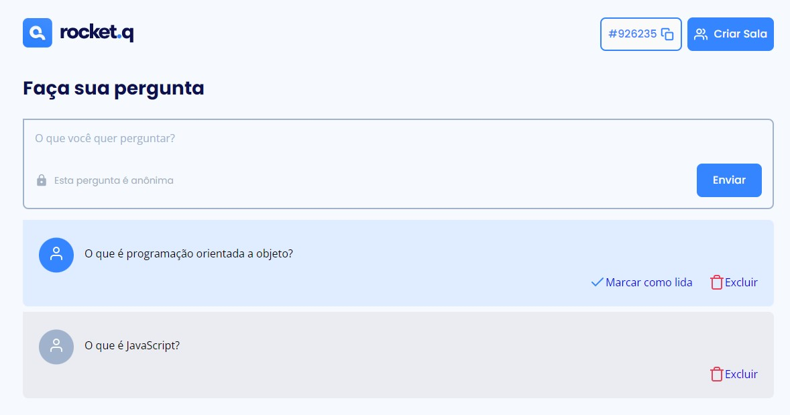

<h1 align="center">Rockect.Q</h1>
<p align="center">
    <a href="#sobre">Sobre |</a>
    <a href="#tecnologias">Tecnologias |</a>
    <a href="#instalação">Instalação |</a>
    <a href="#uso">Uso |</a>
    <a href="#layout">Layout</a>
</p>

<hr>

## Sobre
Aplicação desenvolvida no Bootcamp ofericido pela empresa Rocketseat. 

A aplicação permite criar salas com perguntas anônimas, onde é possível o usuário administrador dessas salas, por meio de senha, excluir e marcar como lida as perguntas cadastradas.  





<hr>

## Tecnologias
<ul>
    <li><a href="https://www.w3schools.com" alt="HTML">HTML</a></li>
    <li><a href="https://www.w3schools.com" alt="CSS">CSS</a></li>
    <li><a href="https://www.ecma-international.org/publications-and-standards/standards/ecma-262/" alt="JavaScript">JavaScript</a></li>
    <li><a href="https://ejs.co/" alt="EJS">EJS</a></li>
    <li><a href="https://nodejs.org/" alt="Node.js">Node.js</a></li>
    <li><a href="https://sequelize.org/" alt="Sequelize">Sequelize</a></li>
    <li><a href="https://www.sqlite.org/" alt="MySQL">SQLite</a></li>
</ul>

## Instalação 
### Instalação de dependências

> Este guia assume que você já tem o Node.js instalado. 

```bash

$ git clone https://github.com/leandrolimadeveloper/Missao-Discover-Rocket-Seat-Backend.git
$ cd Missao-Discover-Rocket-Seat-Backend
$ npm i

```

### Criação do banco de dados

```bash 

$ npm run init-db

```


## Uso 
Após a criação do banco de dados, digite o comando abaixo para iniciar o servidor Node: 

```bash

$ npx nodemon index.js

```

<p>Tendo o servidor iniciado, acesse o endereço <code>localhost:3000</code> em qualquer navegador.</p><br>

<hr>
 
## Layout

Caso tenha interesse em visualizar o layout do projeto, ele está disponível através [desse link](https://www.figma.com/community/file/1009821158959690135/Roquet.q). É necessário ter conta no [Figma](https://figma.com) para acessá-lo.
